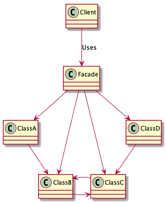

## Facadeパターン

## 概要
- Facade(ファサード)：建物の正門という意味

- 複数あるクラスやメソッドに対して、シンプルな窓口となるインターフェース（API）を提供する。

## 登場人物
- Facade(正面)の役  
  システムを構成しているたくさんのクラスやメソッドなどの**窓口**となる。

- システムを構成しているその他大勢の役  
  クラスやメソッドは、Facade役を意識しない。Facadeから呼び出されることはあるが、Facadeを呼び出すことはない。

- Client(依頼人)の役  
  Facadeを利用する役。

## メリット
- クラスやメソッドがたくさん見えているとどれを使っていいか迷うし、呼び出し方の順番なども注意しなければいけないが、  
  Facadeパターンを利用することで、APIをまとめてインターフェースを少なくすることができる。

