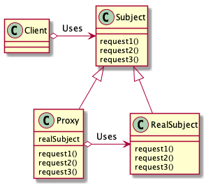

# Proxyパターン

## 概要
　本人の代理人となるProxyオブジェクトが本人でなくともできる処理を行い、本人が必要という場合になったら本人に処理を任せる（委譲）。

## 登場人物
- Proxy(代理人)[PrinterProxy.java]    
  Client役からの要求をできるだけ処理する。Proxyで処理できなくなったら、RealSubject役を生成する。

- RealSubject(実際の主体)[Printer.java]  
  Proxy役で処理できなくなった時に登場する本人役。

- Subject(主体)[Printable.java]  
  ProxyとRealSubjectを同一視するためのインターフェース。Subjectがあるため、ClientはProxyとRealSubjectの違いを意識しないで良い。

  
- Client(依頼人)[Main.java]
  Proxyパターンを利用する役。

## メリット
- 重い処理、頻繁に呼び出される処理とかに有効。
