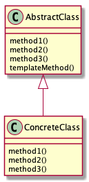

# TemplateMethod

## 概要
スーパークラスで大きな枠組みを決めて、サブクラスで具体的な処理の内容を定めるパターン

## 登場人物
- AbstractClass(AbstractDisplay.java)
大まかな処理の流れを書くクラス。抽象メソッドを宣言する。

- ConcreteClass(CharDisplay.java , StringDisplay.java)
テンプレートで宣言されている抽象メソッドを具体的に実装するサブクラス。

## メリット
- ロジックの共通化ができる -> コピペでロジックを量産するより、ロジックバグの修正コストが低い。
- サブクラスは、テンプレートメソッドに沿って実装していく形になるので設計が楽になる。
- 関連：LSP(Liskov Substitution Principle：リスコフの置換原則)